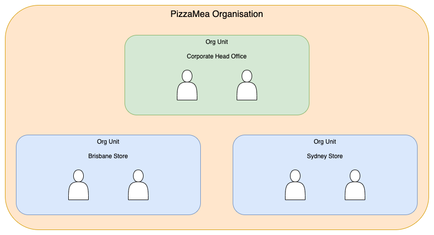
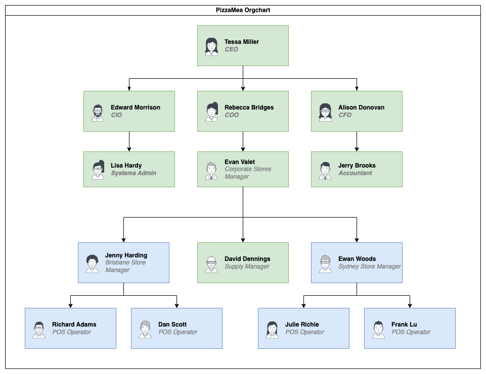

# Fine-grained Authorisation

A demonstration of different concepts in IAM and fined-grained authorisation (FGA) using an examle of moderate complexity.

## Motivation

In Identity and Access Management (IAM), open standards exist to clearly define the mechanisms that can identify who someone is and what they have access too. 
OpenID Connect (OIDC) and OAuth2 have risen to the fore as the de facto standard for IAM and have been highly successful in solving a subset of IAM. Specifically, these open standards have streamlined the process of authentication and high-level authorisation for the benefit of all.

By "high-level authorisation" I mean coarse-grain access controls.  Things like "does this user have access to this application", "is this service allowed to call this particular API" etc. High-level controls are good for a number of reasons:

* They allow applications/gateways to filter incoming requests and reject unauthorised access quickly
* They encourage centralisation of access control so that organisations can quickly audit who has access to what
* They allow the identity provider to efficiently reject access token requests when the user/service doesn't have access to the required OAuth2 scopes
* Access control is encoded in the access token, which can drastically simplify implementation
* They provide a simplified, top-level approach to authorisation and sometimes that is all that is required to enforce security

However, enforcing access control in real-world applications is rarely as simple as implementing high-level OAuth2 scopes. Applications usually contain resources, and those resources typically have an owner. Often the owner is not a simple as a single human, instead involving an inheritance chain controlling access through cascading organisational group memberships.

Users are typically members of an organisation and through operational roles they inherit access to subsets of the organisation's total resources. Sometimes they can access resources but in a limited capacity e.g. read-only, only resources associated with this business unit etc.

Additionally, resource data is often exposed via public APIs and accessed by other services (machine users). The owner of the resource might not want all of the resource's data (i.e. fields) to be available to 3rd party services.

All of the above hint at a need for fine-grain, low-level access controls, in addition to coarse-grain, high-level access controls. Historically each application has typically solved this problem independently and in isolation of other parts of the organisation's application ecosystem. This leads to increasingly complex access control audits and makes reasoning about who has access to specific resources, and in what capacity, a difficult task.

Rather than implementing a bespoke fine-grained access control system from scratch, we will instead work out a specific solution using [OpenFGA](https://openfga.dev/). See the [FGA solutions](./docs/fga_solutions.md) document for a review of the various FGA solution options available (as of Q1 2024), and reasoning about why OpenFGA was chosen.

## The Problem

We consider the problem of implementing IAM at the fictional pizza franchise company PizzaMea (yes, it helps if you say this in a thick Italian accent!).

PizzaMea consists of a governing corporate entity, and a couple of franchised stores located in Brisbane and Sydney.

The corporate entity houses the various c-suite roles typical of a company, as well as maintaining oversight of the national supply chain for all stores. Stores are run by local managers, with staff operating Point Of Sale (POS) equipment on-site.

The company has a significant investment in technology and operates a combination of 3rd-party software and infrastructure, as well as a number of internal and publicly facing applications.

| Application | Description/Purpose | High-level Access Restrictions |
| ----------- | ------------| ------------------- |
| POS | Over the counter orders and sales | Store manager   Store POS operators |
| Stock Manager | Stock item manager for all stores   Store managers can order stock for their own store | Supply Manager   Store manager |
| Accounting Software | Manage accounting for entire business | CFO   Accountants |
| Reports | Business health and performance reporting | COO   Corporate Stores Manager   Store Managers |
| Security and Auditing | Business-wide security   Audting and access control enforement | CIO   Systems Administrators |
| Strategy Manager | Business-wide strategy and decision tools | CEO   COO   CIO   CFO |

Following best practice security, the company has decided to implement an IAM solution with the following properties:

1. Single Sign-on for anyone that needs to interact with the company's systems and data
2. Zero Trust principles, specifically:
    1. Everything requires authentication and authorisation
    2. Tight control over who has access to what
    3. Just-in-time authorisation for mutable role duties
    4. Minimsation of damage when breaches occur
3. Ability to partition access control decisions based on a number of factors, including:
    1. User and resource relationships
    2. Location
    3. Day and time

Our job is to propose an IAM solution that covers the above requirements, and then deliver a working proof-of-concept (PoC) of the proposal that demonstrates how the core requirements have been met.

## Problem Analysis and Recommendations

### Sign-On

Because the company employees must access a number of distinct applications in their daily duties, a centralised sign-on system is required. Maintaining a user's session across various applications will increase productivity and lower friction when switching between applications.

#### Sign-on recommendations

Adopt the OpenID Connect and OAuth2 standards, which support a variety of sign-on and access control scenarios.

This recommentation can be satisifed by any one of a growing number of on-premise or hosted Identity Provider (IdP) SaaS offerings, and is well-supported for all types of applications that PizzaMea will use or develop.

In this case, we recommend [KeyCloak](https://www.keycloak.org/) as the IdP (primarily for ease of demonstration and running locally).

### Zero Trust Principles

Ensuring that everything in the company's private and public networks requires an authenticated user/service is a non-negotiable requirement.

We can broadly partition access control decisions into two types:

1. High-level access controls
    1. These can be checked at the time of application sign-in
    2. Typically these assignments mutate infrequently, often being assigned during commencement of employment or a new role, and being revoked upon employment or role cessation
    2. Typically involves inspecting a user's group membership to ensure the application has been assigned to the user/service during sign-in/redirection to the application
2. Low-level access controls
    1. These are dynamic assignments that can change during the course of a user's signed-in session
    2. They are typically application-specific and have meaning in the context of what a user is able to do inside the specific application
    3. They are suitable for modelling just-in-time authorisation and resource access relationships
    4. They can be removed/adjusted while the user is signed in, without requiring the user to re-authenticate, and thus are a good option for immediately revoking access rights when responding to a breach incident or adjusting a user's real-time access level

#### Zero Trust reccommentations

Use group modelling and group membership in the chosen IdP to control assignment of applications to users.

Use OAuth2 scopes for high-level access control to have coarse-grain access control decisions encoded in access tokens.

Develop a system of OAuth2 scopes that model typical roles assigned to users and how these relate to high-level application access.

Offload access check logic from applications and instead utilise low-latency remote checks by calling into a centralised FGA system at key points in each application.

Use [OpenFGA](https://openfga.dev/) to model low-level access controls and achieve dynamic just-in-time authorisation checks. 

### Partitioned Access Control

Being able to encode logic into access control checks will require an FGA system that is capable of representing contextual, rule-based access controls.

#### Partitioned Access Control reccommentations

Use [OpenFGA](https://openfga.dev/docs/modeling/contextual-time-based-authorization) to model low-level, contextual access control checks.

## Proof of Concept (PoC)

In order to demonstrate the various IAM mechanisms, we'll need a number of things:

1. Core Infrastructure - see [Infrastructure and Applications Setup](./docs/infrastructure_app_setup.md) for details
2. KeyCloak configuration that models users, groups, applications, and OAuth2 scopes - see [KeyCloak Config](./docs/keycloak-config.md) for details
3. APIs representing the various bespoke PizzaMea applications, configured to accept access tokens with appropriate OAuth2 scopes as required - see [API setup](./docs/apis.md) for details
4. An appropriate OpenFGA authorization model that captures the fine-grained authorisation logic - see [OpenFGA Model](./docs/openfga-model.md) for details
5. A way to test and validate the entire IAM stack